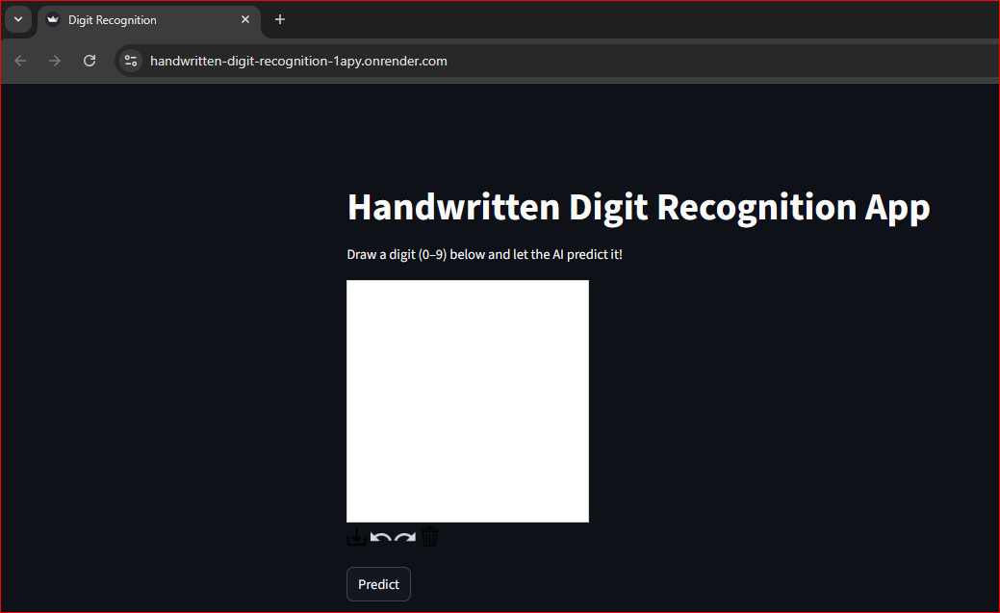
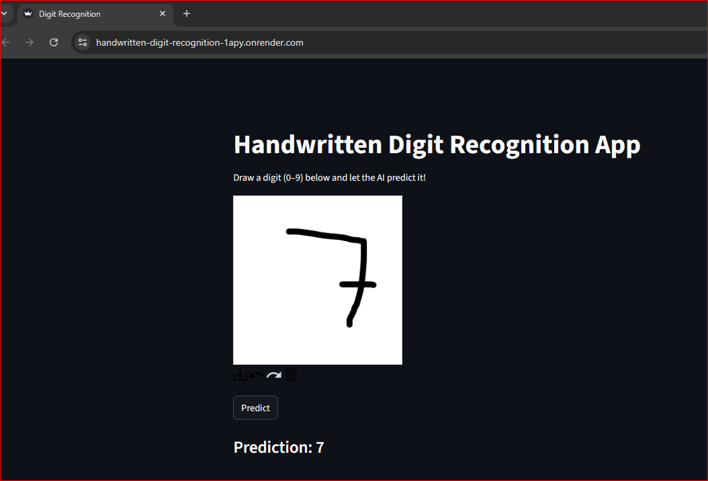

# 🧠 Handwritten Digit Recognition App  
An end-to-end Deep Learning project that recognizes handwritten digits (0–9) using a Convolutional Neural Network (CNN).  
Built with **TensorFlow**, **Streamlit**, and deployed on **Render** for a live demo.

---

## 🚀 Project Overview
This project demonstrates a complete AI workflow — from training a CNN model to deploying it as an interactive web app.

### 🔍 Key Features
- ✏️ Draw digits (0–9) directly in the browser.
- 🧩 Pretrained CNN model trained on MNIST dataset.
- ⚙️ Real-time prediction using Streamlit.
- ☁️ Deployed seamlessly on Render.
- 📦 Modular project structure for clarity and scalability.

---

## 🧱 Project Structure
```
Handwritten-Digit-Recognition-App/
│
├── app.py                  # Streamlit UI for drawing & prediction
├── train_model.py          # CNN model training script
├── model/
│   └── digit_model.h5      # Saved trained model
├── requirements.txt        # Python dependencies
├── runtime.txt             # Specifies Python version (3.10)
└── README.md               # Documentation
```

---

## 🧠 Model Training

Run these commands to train your CNN model locally:

```bash
# 1️⃣ Create virtual environment
python -m venv venv
venv\Scripts\activate      # (Windows)
# source venv/bin/activate  (Mac/Linux)

# 2️⃣ Install dependencies
pip install -r requirements.txt

# 3️⃣ Train the model
python train_model.py
```

This will create `digit_model.h5` inside the `model/` folder.

---
## Live Demo
[Demo](https://handwritten-digit-recognition-1apy.onrender.com/)  

## 🌐 Deployment on Render

### Step 1: Make Sure You Have These Files
```
runtime.txt
requirements.txt
app.py
```


```
web: streamlit run app.py --server.port $PORT --server.address 0.0.0.0
```

**runtime.txt**
```
python-3.10.14
```

### Step 2: Push Your Code to GitHub
```bash
git add .
git commit -m "Initial commit - Streamlit Digit Recognition App"
git push origin main
```

### Step 3: Deploy on Render
1. Go to [Render Dashboard](https://render.com)  
2. Click **New + → Web Service**  
3. Connect your GitHub repository  
4. Set **Build Command:**
   ```
   pip install -r requirements.txt
   ```
5. Set **Start Command:**
   ```
   streamlit run app.py --server.port $PORT --server.address 0.0.0.0
   ```
6. Click **Deploy** 🚀

Once deployed, your app will be live at:
```
https://your-app-name.onrender.com
```

---

## 🖼️ Streamlit App Demo
*(Add screenshots after deployment)*

| Draw Digit | Model Prediction |
|-------------|-----------------|
|  |  |

---

## 🧩 Tech Stack

| Component | Technology |
|------------|-------------|
| **Language** | Python 3.10 |
| **Framework** | TensorFlow, Keras |
| **Frontend** | Streamlit |
| **Deployment** | Render |
| **Dataset** | MNIST Handwritten Digits |

---

## 🧑‍💻 Author
**Mithilesh Chaurasiya**  
📎 [Portfolio](https://mithileshchaurasiya.me)
💼 [LinkedIn](https://www.linkedin.com/in/mithilesh1627)  
🧠 Passionate about Data Engineering, MLOps, and AI Engineering.

---

## ⭐ Future Improvements
- 🔁 Enable model retraining from UI  
- 🔢 Multi-digit recognition  
- ⚙️ Add REST API via FastAPI  
- 🧪 Integrate CI/CD (GitHub Actions)

---

### 💫 Star this repo if you like it!  
It motivates me to build and share more AI projects 🚀
